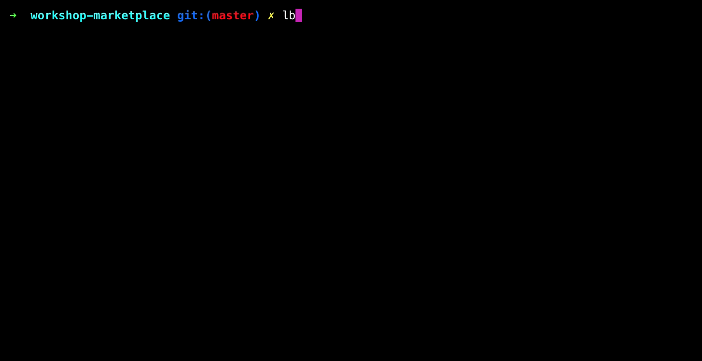
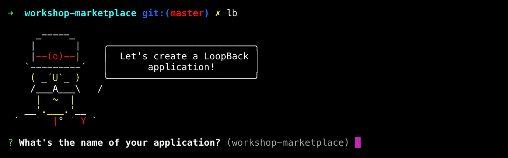
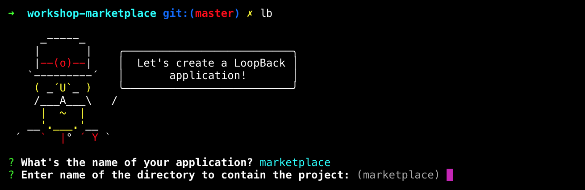
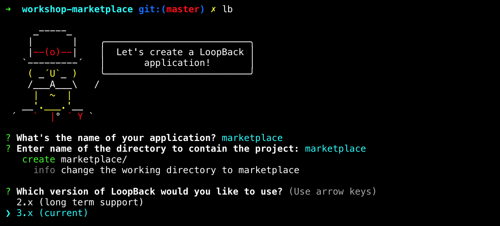
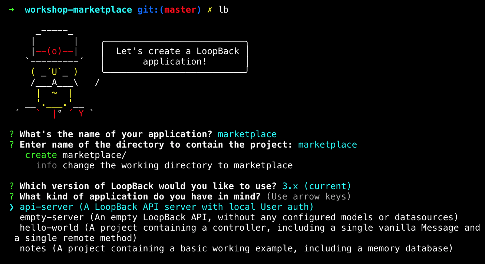
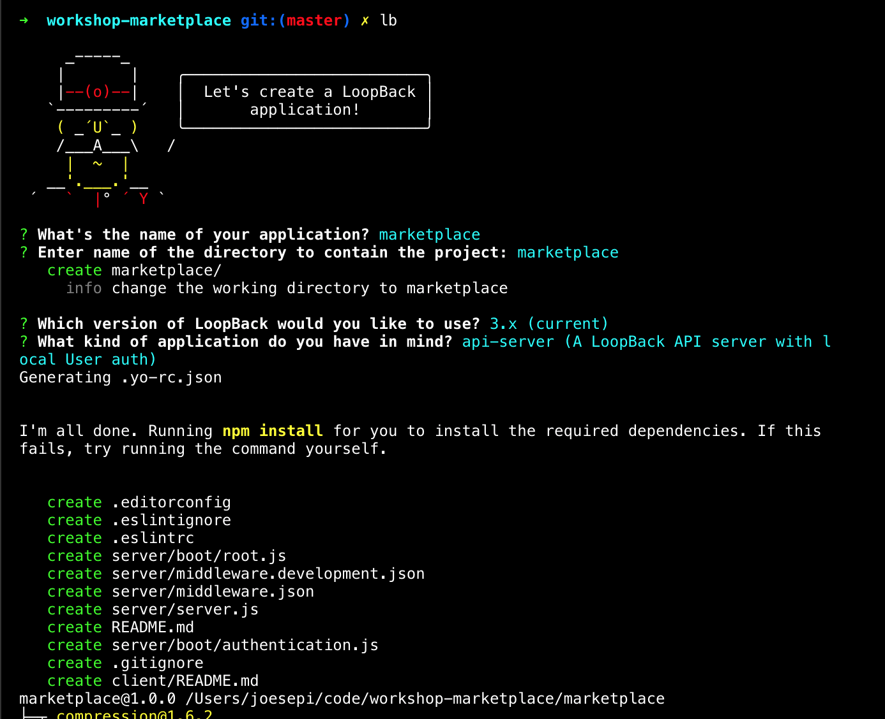
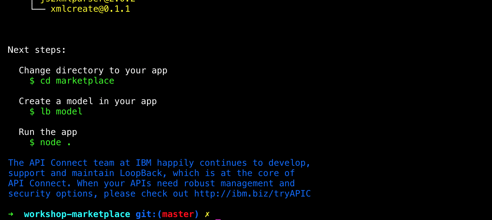

# Workshop: Marketplace
_WIP_

End Goal: build a marketplace application with products, users (buyers/sellers) and a shopping cart.

## Prerequisites

- [Node.js](https://nodejs.org/en/) (includes npm)
- [Loopback](http://loopback.io/)

## Some context

LoopBack is a framework built on top of Express to rapidly build out RESTful APIs in Node.js. The primary entry point for LoopBack application development is through a command line terminal, such as Terminal, iTerm or Hyper. Through an interactive command line prompt, the LoopBack application generator takes your responses to a series of questions and scaffolds out the application endpoints along with a configuration file. In moments, you can have a REST API up and running and the configuration file is very easy to understand and manipulate by hand. There are a number of commands you can invoke through the cli (command line interface) that will help you to build and shape your APIs, which we will explore through this workshop.

## Create a new Loopback application

To initialize a Loopback application, you invoke the LoopBack [application generator](http://loopback.io/doc/en/lb3/Application-generator) by typing `lb` and follow the prompts in the cli:

Looks powerful, yet easy, right? Okay, let's go through those steps, one by one.

**Invoke initialization process**

You can do so by typing `lb` or `lb app` and this will invoke the generator.

#### What's the name of your application?

The first step is to name the application.

#### Enter name of the directory to contain the project:

The next step is simply to choose the name of the directory that you are going to build out the application into. By default, it assumes you would like to create a directory with the same name as the application that you have given in the previous step. Hitting enter will do the default, but if you want to name your directory something else, you can do so here. You may have already created this directory name and are in it within the terminal, in which case, you can simply type `.` to denote the 'current directory'.

You'll notice in the next step that the prompt informs you that it created the directory and has navigated into that directory for building the application. Note that when completed, you will be in the same directory in which you started, which may be one level above your new working directory.

#### Which version of LoopBack would you like to use?

LoopBack is now on version 3, but version 2 is still being supported. It is advised to use the current version of LoopBack (`3.x`) which is chosen by default.

#### What kind of application do you have in mind?

The user is presented with 4 options as starting points for scaffolding a LoopBack application.

- api-server (A LoopBack API server with local User auth)
- empty-server (An empty LoopBack API, without any configured models or datasources)
- hello-world (A project containing a controller, including a single vanilla Message and
 a single remote method)
- notes (A project containing a basic working example, including a memory database)

We will choose the default option as it is useful to have a built-in User model to extend from when building our model for our users.

_Note: as alluded to above, it is discouraged to use the base model directly. Instead, you always should extend built-in models so they may be reused without adverse effects._

_Protip: in the command line, you can type `j` or `k` to navigate up or down._

#### Scaffolding application and running `npm install`

At this point, your application has been scaffolded and then the generator runs `npm install` to retrieve all of your external dependences. This may take a moment, depending on your internet connection. Do not be alarmed by the many modules that are installed. Node.js has a large ecosystem of many small modules, in an effort to reduce duplication of effort. NPM, the node package manager, handles these modules in a smart and efficient manner.

Once the installation of external modules is complete, you will see a listing of these modules in a tree structure.

#### Handy next steps for your convenience

