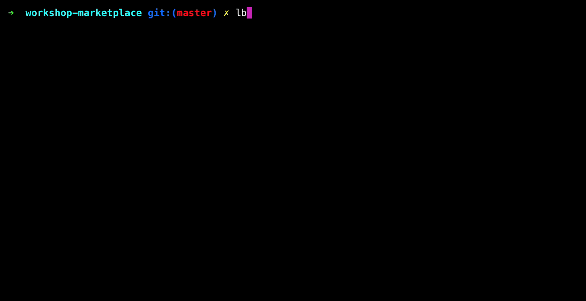

# Workshop: Marketplace
_WIP_

End Goal: build a marketplace application with products, users (buyers/sellers) and a shopping cart.

## Prerequisites

- [Node.js](https://nodejs.org/en/) (includes npm)
- [LoopBack](http://loopback.io/)

## Steps

- [Create a LoopBack application](workshop/00-initialization.md)
- [First model based API](workshop/01-first-api.md)

## What is LoopBack?

LoopBack is a framework built on top of Express to rapidly build out RESTful APIs in Node.js. The primary entry point for LoopBack application development is through a command line terminal, such as Terminal, iTerm or Hyper. Through an interactive command line prompt, the LoopBack application generator takes your responses to a series of questions and scaffolds out the application endpoints along with a configuration file. In moments, you can have a REST API up and running and the configuration file is very easy to understand and manipulate by hand. There are a number of commands you can invoke through the cli (command line interface) that will help you to build and shape your APIs, which we will explore through this workshop.

To initialize a Loopback application, you invoke the LoopBack [application generator](http://loopback.io/doc/en/lb3/Application-generator) by typing `lb` and follow the prompts in the cli.

Looks powerful, yet easy, right? Okay, let's go through those steps, one by one.

**Next Step:** [Create a LoopBack application](workshop/00-initialization.md)
