# Create your first LoopBack model/API

LoopBack takes a model driven approach to building out APIs. Based on your responses to the command line prompts, it will create a JSON file with your model schema and details.

To invoke the generator, we type `lb model` and go through the list of prompts.

## Enter the name of your model

We'll call our first model while building our marketplace app `product`.

_Note: your model should be singular. The application handles plural naturally, as you'll see in an upcoming step._

## Select the data-source

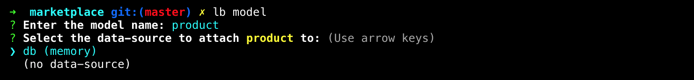

LoopBack has connectors for many, many data-sources. The most common ones are supported by the StrongLoop team and there is a plethora of community supported connectors that are less common. Later in the workshop, we will add a conventional data-source, for the time being, let's just use the in-memory data-source. It is the only one listed here because when you use other data-sources, you need to `npm install` them. Again, we'll get to that later.

_Note: an issue with using the in-memory data-source is that every time you shut down your application, you will lose all your data. Again, using the in-memory data-source is only for testing and prototyping. Later in this section, we will look at persisting your in-memory data to a file._

## Select model's base class:

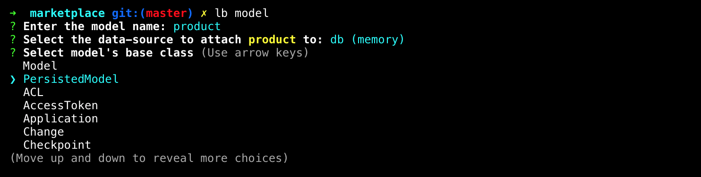

The base class for a model is the object that this model will extend from. There are a number of base model classes and each has a specific purpose. We will choose the `Persisted Model` because we will eventually want the persistence functionality baked right into our base class. We'll get that "for free" with this choice.

## Expose `<model>` via the REST API?

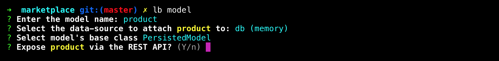

There may be reasons for keeping your endpoint private, but for the sake of this workshop, we will expose our REST API endpoints for public consumption. We will look at securing endpoints later in the workshop.

## Custom plural form

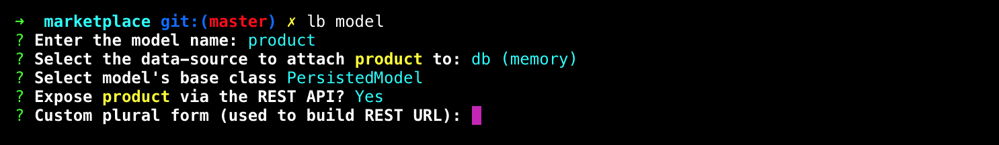

LoopBack is very smart about handling plural forms of your model. In this case, `product` is easily made plural as `products`, but it can also handle other common plurals such as `child` to `children` and `mouse` to `mice`. If you have an unconventional model name that isn't easily made plural by adding an `s` then you may need to take advantage of this feature. Most cases, we can let LoopBack do its magic.

## Common model or server only?

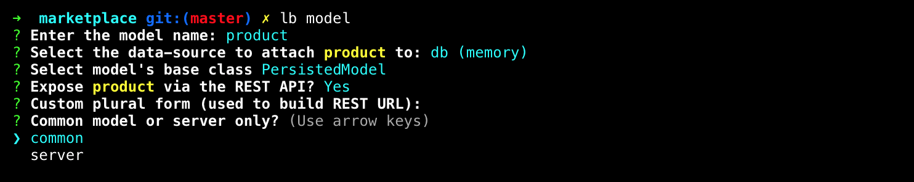

You can choose to only have this model available to the server or you can make it available to the client as well. In an effort to be forward thinking, we will choose `common` in case we want to use the Angular SDK or any other client options in the future.

## Let's add some properties now!

Now that we have our model config in place, we will move on to specific model properties. The prompts will guide us, and as you'll see, after your last property is captured, you can hit enter and it will exit the prompt.

## Model property: name

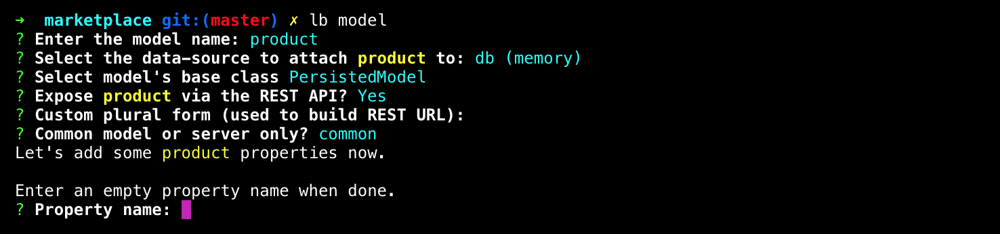

We will begin with the `name` property.

## Model property: type

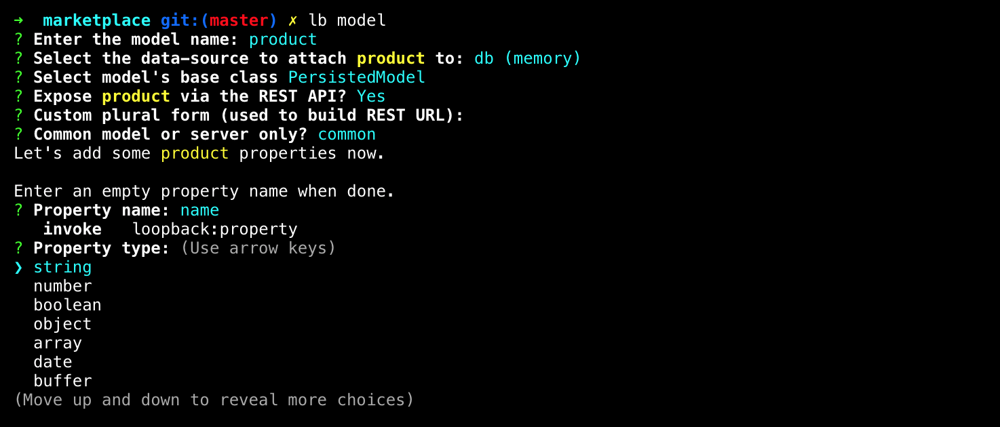

The type of our `name` property will be `string` in this case, but as you can see, there are many options. Having the type set for our properties is important when doing validation, which we will visit later.

## Model property: required

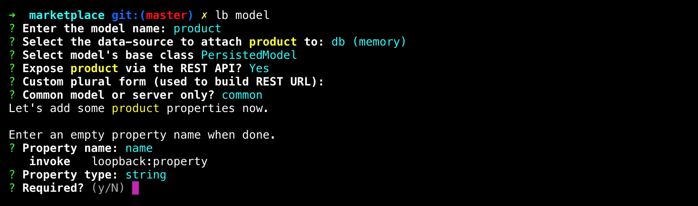

We will make our name property required as it is an important piece of information.

## Model property: default value

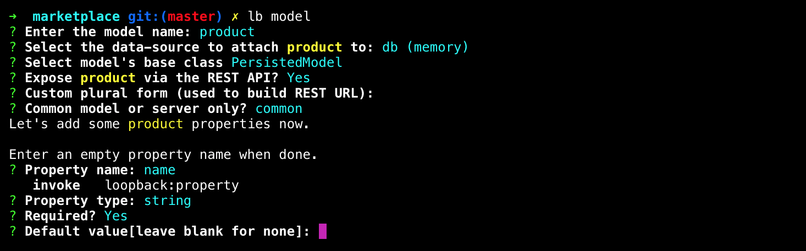

We will leave our default value blank here.

## Next model property

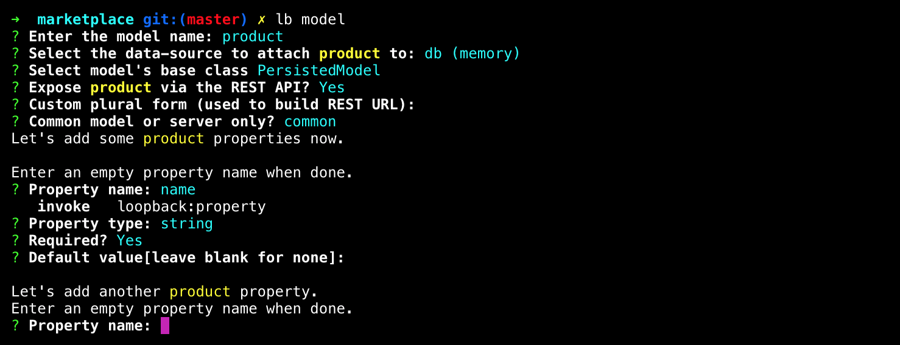

As I mentioned above, when we are done, we can simply hit enter when prompted for another property. In this case, though, we are going to add a `description` and a `price`. See the details for all three properties below:

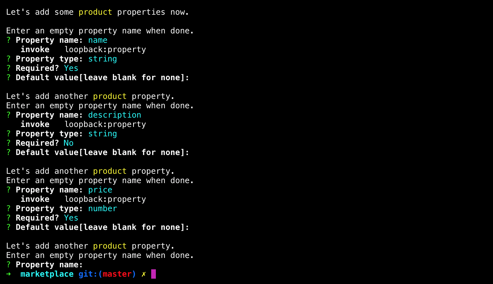

Once you are done adding your properties, hit `<enter>` and the prompt will exit.

**Next Step:** [API Explorer](02-api-explorer.md)

