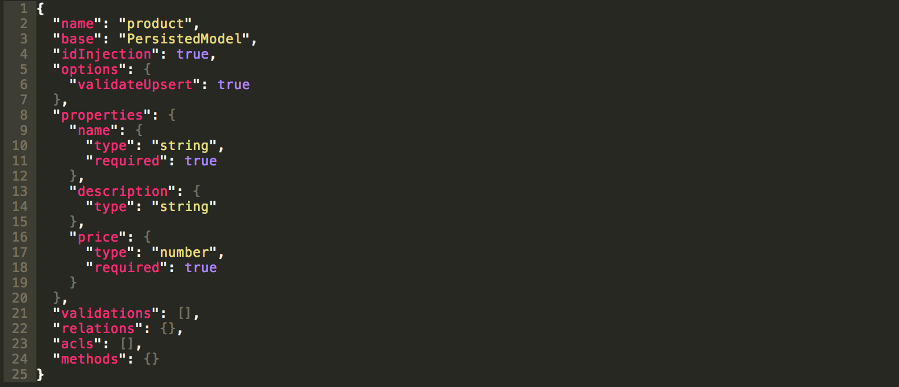
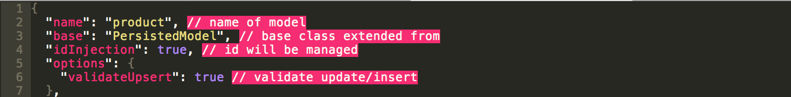
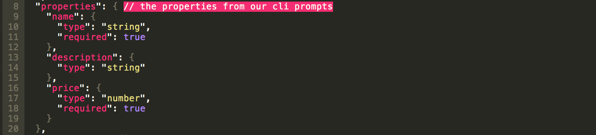
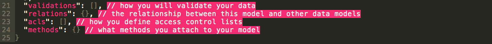
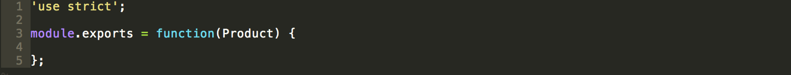

# Model files: config and hooks

## Model config

`/models/common/product.json`



The `product.json` file is generated based from the answers we gave to the CLI in the previous step. What I find most impressive about LoopBack, especially from a new user's perspective, is that not only is the command line generator easy and quick to use, but the configuration file that is outputted (this `product.json` file) is very easy to understand.

#### Lines 2-7: let's call this meta data



I've commented in the file to make it easier to understand. These first few lines are what I would refer to as meta data and options.

#### Lines 8-20: properties



The `properties` block is what was generated when we created our model based on the CLI prompts. This configuration block is maleable, so if you decide later that you want a property to be required and a default value provided, you can just edit this file. It is very easy to get into the configuration and make your needed changes.

#### Lines 21-25: additional options



These final object keys have empty values. We will get to how these work later in the workshop. I think you may find them named in obvious ways, but I have commented them as well to give a little more insight if needed.

## Model hooks

`/models/common/product.js`



The generator also creates a corresponding JavaScript file to allow you to add remote methods to your endpoint. As you can see above, we have a simple function waiting to add in functionality.

Below is an example of a remote method from the LoopBack documentation that adds an endpoint called `status` that returns whether the coffee shop is open or closed based on the time.

```javascript
module.exports = function(CoffeeShop) {
  CoffeeShop.status = function(cb) {
    const currentDate = new Date();
    const currentHour = currentDate.getHours();
    const response = (currentHour > 6 && currentHour < 20) ?
      'We are open for business.' :
      'Sorry, we are closed. Open daily from 6am to 8pm.'

    cb(null, response);
  };
  CoffeeShop.remoteMethod('status', {
      http: {path: '/status', verb: 'get'},
      returns: {arg: 'status', type: 'string'}
    }
  );
};
```

And below is an example of a `beforeRemote` method that adds a timestamp to a Review object before the create request is fulfilled.

```javascript
module.exports = function(Review) {
  Review.beforeRemote('create', function(context, user, next) {
    context.args.data.date = Date.now();
    context.args.data.publisherId = context.req.accessToken.userId;
    next();
  });
};
```

## Save your data!

Before we move on to exploring our API with the explorer user interface, let's make sure our data is saved to a file so we don't lose it each time we stop our application. You can do so by updating `server/datasources.json` to have the `file` key. My datasources.json looks like so:

```json
{
  "db": {
    "name": "db",
    "connector": "memory",
    "file": "db.json"
  }
}
```

**Next Step:** [API Explorer](04-api-explorer.md)
