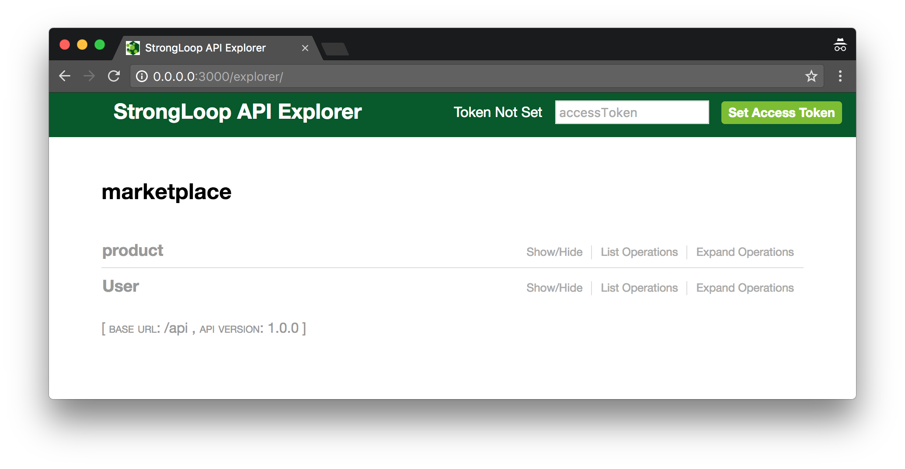
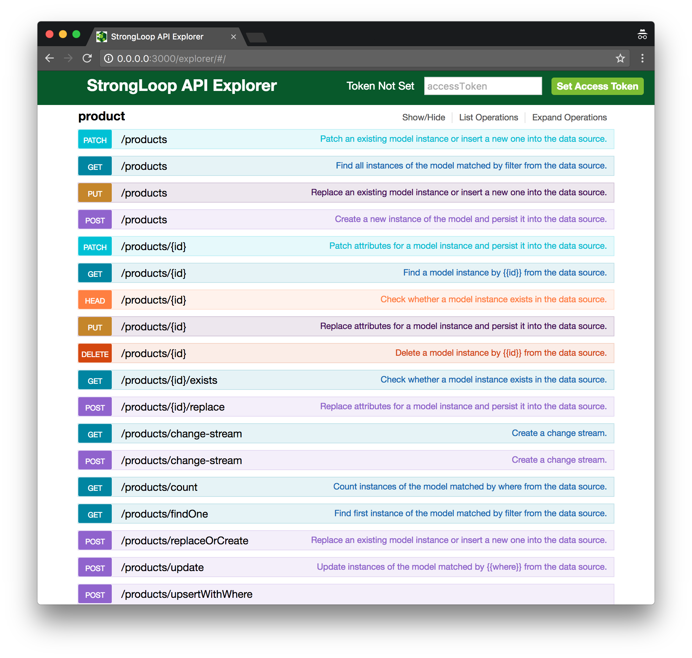
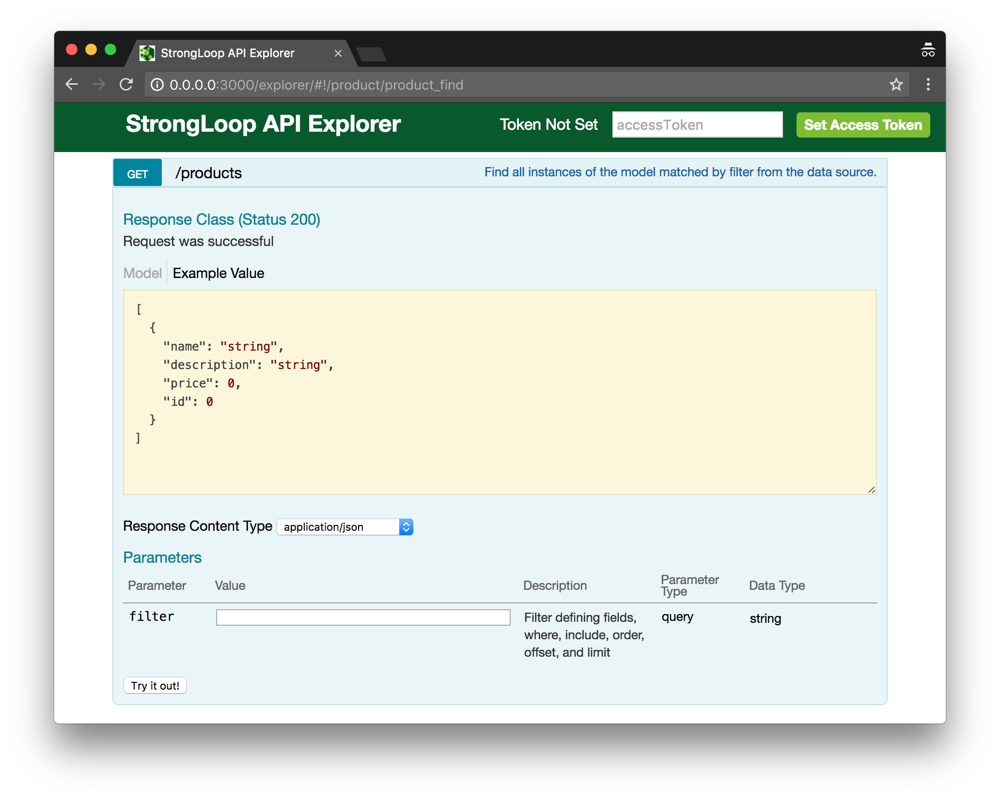
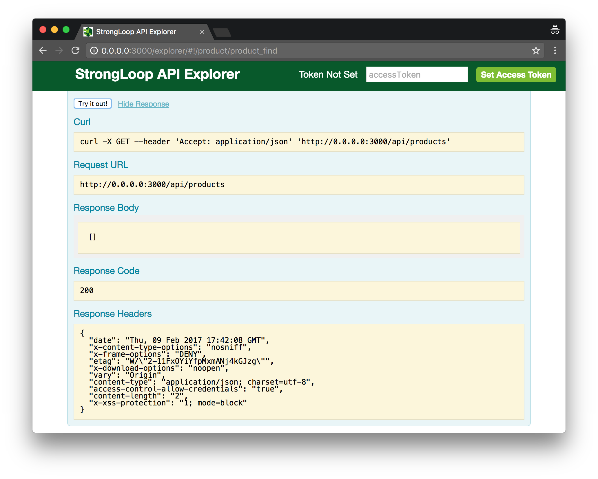
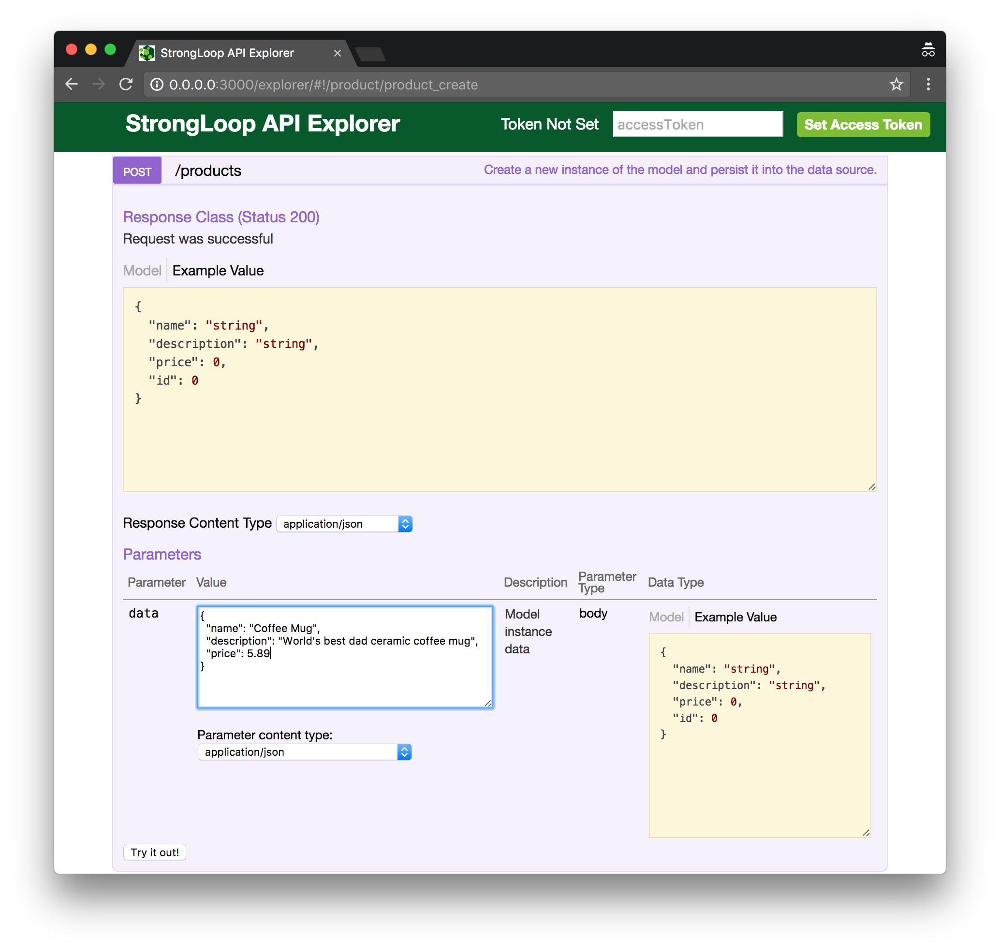
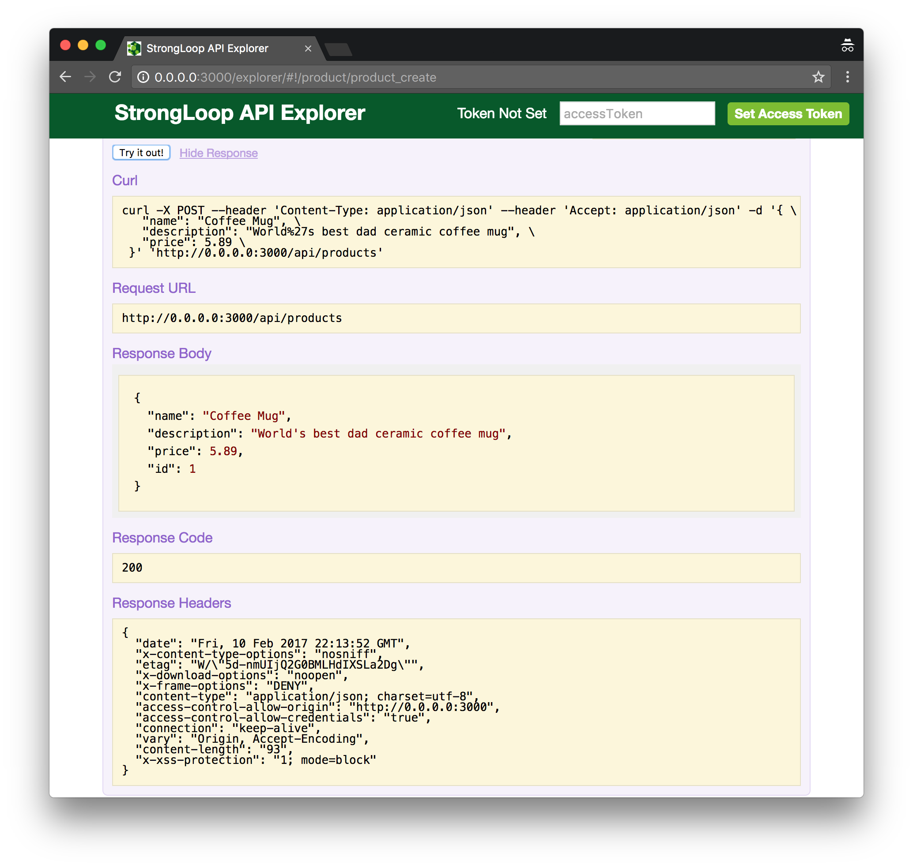
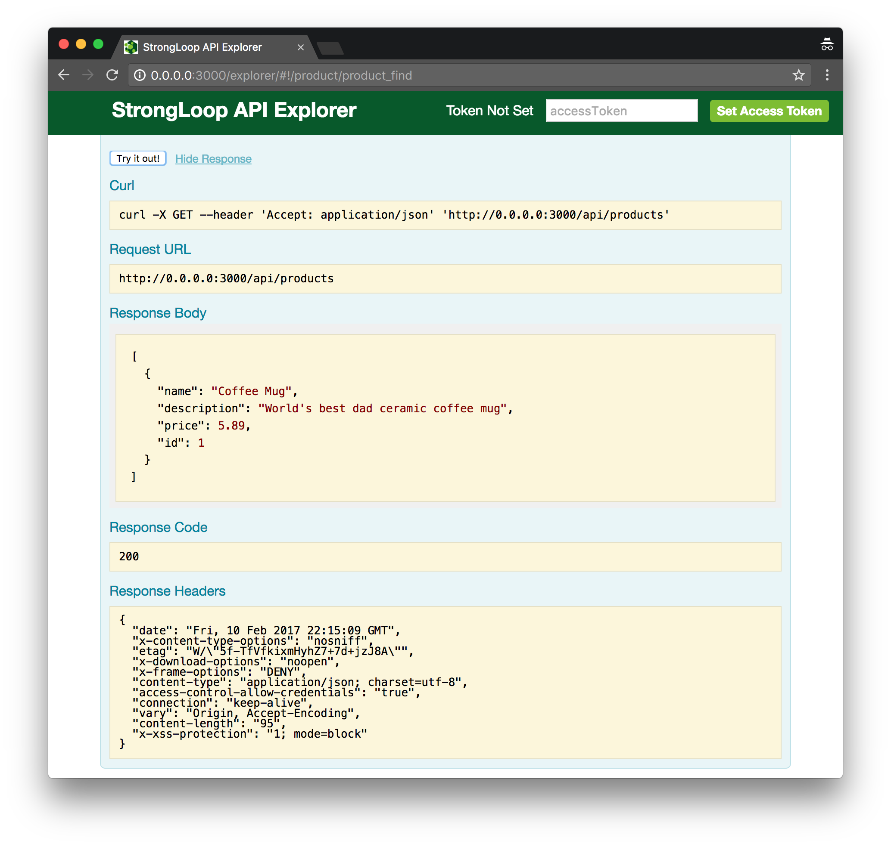

# Exploring the API Explorer

We've initialized a LoopBack application and built out our first model-driven RESTful API endpoint for `product`. Let's run the application using `node .` and take a look at the API Explorer UI.


### Start our application


As we can see above, we have started our node.js application and upon startup, it helpfully tells us what URL our application is using and full URL to the API Explorer. Let's go to the Explorer URL and engage with our endpoints.

_Pro tip: most terminal applications will launch a URL if we `cmd + click` on the text._

### API Explorer



The browser opens up to a page that lists our API endpoints. We'll see one for `product` and one for `User`.

The **User** endpoint is the base class that is provided by the `api server` choice we made when initializing our application. It is the class that we would extend from when making a `members` model, for example.

_Pro tip: a programming convention is to name Base classes with a capital letter. Reminder: Base classes are the ones that we do not edit directly, but instead extend from._

The **product** endpoint is the one created in the previous step based on our answers to the prompts.

### Our first endpoint: `product`



This is where the magic of LoopBack shines through for those just getting started. Based on the questions related to our model, we are given this full RESTful API. I'll take this moment to remind us: we haven't written any code yet. ✨MAGIC✨ (And some super-smart generator actions.)

### A GET request



If we open up the details of the GET request panel in our explorer, we will see some details of our model schema, a parameter section (we'll get to later), as well as a button to "Try it out!"

### A GET request - Try it out!



In addition to providing some sample request examples (Curl and URL), we also see that the GET request is successful with a 200 response, but the response array is empty. That's because we don't have any data! We've only described our data, but we haven't actually added any to our data-source. Let's try adding some data using the POST method.

*Pro tip: if we want to learn more about HTTP responses, we can read more [here](https://en.wikipedia.org/wiki/List_of_HTTP_status_codes). Our personal favorite is `418 - I'm a teapot`.*

### A POST call - add some data



If we scroll down the page of HTTP verbs, we will see a few POST options. The first one should be `POST /products`. Open that panel by clicking on it and it should look similar to the GET panel we saw above. We are going to 'Try it out!'. To do so, we can click on the text field with the yellow background in the Parameters section and doing so will populate the text field with the white background with example data. In the image above, I added edited the example data like so:

```json
{
  "name": "Coffee Mug",
  "description": "World's best dad ceramic coffee mug",
  "price": 5.89
}
```

We may notice that we deleted the `id` key/value in the data. If we send an `id`, we may get an error because that field is managed by the data-source. After entering this data into the text field, we can click the 'Try it out!' button to POST this data to the endpoint.



We'll notice that we are successful: we get a `200` response and the response body includes the data we sent with an actual `id` returned. To verify the successful POST, let's go back to the GET request and "Try it out!"



Yay! Again, we get the `200` response and this time, the GET request returns an array with the object we had POST-ed in the previous step. Exciting, right?

WHATS NEXT?
